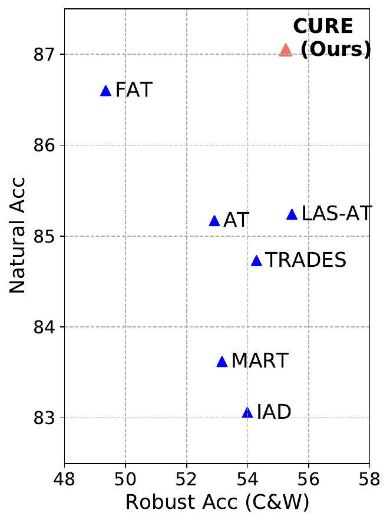

This is the official code for ICLR paper, **"Conserve-Update-Revise to Cure Generalization and Robustness Trade-off in Adversarial Training"** by Shruthi Gowda, Elahe Arani and Bahram Zonooz.

[//]: # (![image info]&#40;./src/hyper.png&#41;)


## Requirements
- python==3.8.0
- torch==1.10.0
- torchvision==0.8.0 

## Setup

CURE is a selective adversarial training method. It is trained and tested on three different datasets 
using three different architecture (ResNet18, WideResNet34-10 and PreActResNet18). The learning rate is 0.1, 
the number of epochs is 200 and the weight decay is 5e^-3. The revision rate r 
and decay factor d for the revision stage are set to 0.2 and 0.999 for all the experiments.


## Running

#### Train DUCA - CIFAR-ResNet18 
```
best_params_cifar = {
'epochs': 120,
'lr': 0.1,
'lr_decay_ratio': 0.1,
'scheduler': 'None',
'weight_decay': 0.0007,
'batch_size': 128,
'alpha': 0.1,
'percent': 30,
'gamma': 1.0,

}
```

```
train_params = best_params_cifar
python train.py 
    --experiment_id exp_cure \
    --seed 0 \
    --model_architecture duca \
    --train_mode cure \
    --adv_mode cure_dual \
    --dataset cifar10 \
    --reinit
    --lr {train_params['lr']} \
    --lr_decay_ratio {train_params['lr_decay_ratio']} \
    --n_epochs {train_params['n_epochs']} \
    --batch_size {train_params['batch_size']} \
    --percentile {train_params['percent']} \
    --w_nat {train_params['alpha']} \
    --w_rob {train_params['(1 - alpha)']} \
    --aux_loss_wt {train_params['gamma']} \
    --ema_alpha {0.999} \
    --ema_update_freq 0.2 \
    --tensorboard \
    --csv_log \
```

## Cite Our Work

## License

This project is licensed under the terms of the MIT license.

